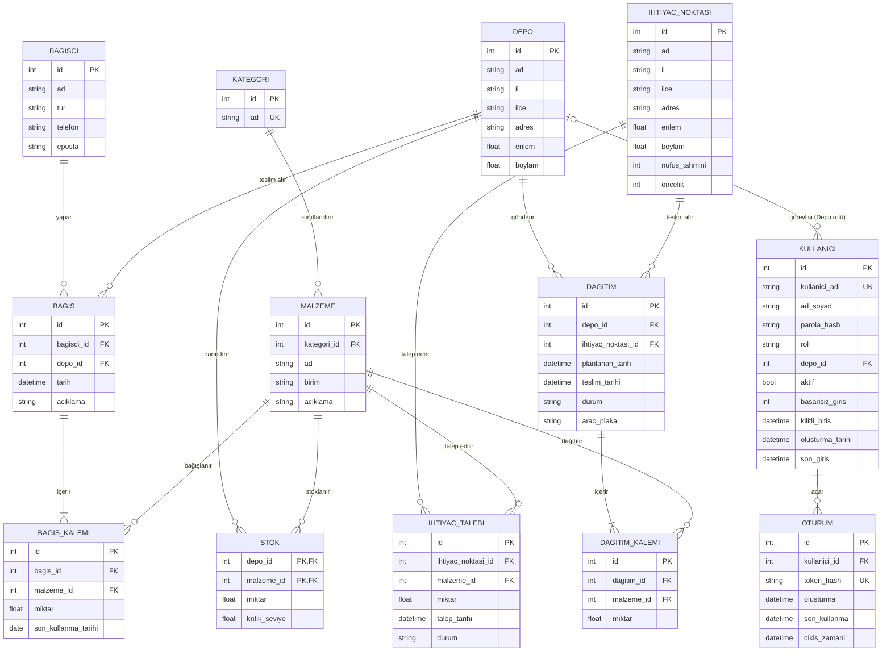

# ER Diyagramı — P16 Afet Yardım Malzemesi Lojistik ve Dağıtım

Görsel sürüm: [er-diyagrami.svg](er-diyagrami.svg). Fiziksel şema (SQL): [001_ilk_sema.sql](../backend/data/migrations/001_ilk_sema.sql), açıklaması: [Veritabani.md](Veritabani.md). Aşağıdaki Mermaid diyagramı GitHub'da otomatik çizilir.

## Varlıklar

| Varlık | Açıklama | Birincil anahtar |
|---|---|---|
| **Kategori** | Malzeme grubu (Gıda, Barınma, Hijyen, Sağlık…) | `id` |
| **Malzeme** | Dağıtılabilen ürün tanımı (birimiyle: adet, koli, kg…) | `id` |
| **Depo** | Bağışların toplandığı ve dağıtımın çıktığı yer | `id` |
| **Bağışçı** | Bağışı yapan kişi/kurum (yalnızca **sentetik** veri) | `id` |
| **Bağış** | Bir bağışçının bir depoya yaptığı tek teslimat (başlık) | `id` |
| **Bağış Kalemi** | Bağışın içindeki malzeme + miktar satırları | `id` |
| **Stok** | Hangi depoda hangi malzemeden ne kadar olduğu | `(depo_id, malzeme_id)` bileşik |
| **İhtiyaç Noktası** | Yardım ulaştırılacak yer (çadır kent, okul…) | `id` |
| **İhtiyaç Talebi** | Bir noktanın bir malzemeye olan ihtiyacı | `id` |
| **Dağıtım (dağıtım kaydı)** | Depo → ihtiyaç noktası sevkiyatı (başlık) | `id` |
| **Dağıtım Kalemi** | Sevkiyattaki malzeme + miktar satırları | `id` |

## İlişkiler

| İlişki | Tür | Nasıl modellendi |
|---|---|---|
| Kategori – Malzeme | 1-N | `malzeme.kategori_id` FK |
| Bağışçı – Bağış | 1-N | `bagis.bagisci_id` FK |
| Depo – Bağış | 1-N | `bagis.depo_id` FK |
| Bağış – Malzeme | **N-N** | `BAGIS_KALEMI` ara tablosu |
| Depo – Malzeme | **N-N** | `STOK` ara tablosu (bileşik PK) |
| İhtiyaç Noktası – Malzeme | **N-N** | `IHTIYAC_TALEBI` ara tablosu |
| Depo – İhtiyaç Noktası | **N-N** | `DAGITIM` (bir depo birçok noktaya, bir nokta birçok depodan) |
| Dağıtım – Malzeme | **N-N** | `DAGITIM_KALEMI` ara tablosu |

1-1 ilişkiye bu projede gerek yok. Örnek: ileride her depoya tek bir sorumlu kullanıcı atanırsa `Depo – DepoSorumlusu` 1-1 olurdu.

## Normalizasyon (1NF – 3NF)

- **1NF:** Her hücrede tek değer var. Bir bağışta birden çok malzeme olabildiği için malzemeler bağış tablosuna sütun olarak (`malzeme1, malzeme2…`) yazılmadı; ayrı `BAGIS_KALEMI` satırları olarak tutuldu.
- **2NF:** Bileşik anahtarlı `STOK` tablosunda `miktar` ve `kritik_seviye` anahtarın tamamına (depo **ve** malzeme) bağlı. Malzeme adı gibi yalnızca `malzeme_id`'ye bağlı bilgi STOK'ta tutulmuyor.
- **3NF:** Geçişli bağımlılık yok. Örneğin malzemenin kategori adı `MALZEME` içinde tekrar yazılmıyor; `kategori_id` üzerinden `KATEGORI` tablosundan geliyor.

## Tasarım kararları

- **Başlık + kalem yapısı** (Bağış/BağışKalemi, Dağıtım/DağıtımKalemi): fatura mantığı; bir teslimatta birden çok malzeme olabilir. Şeffaflık raporunda (Hafta 11-12) "bu bağış hangi dağıtımla nereye gitti" sorusu bu tablolar üzerinden izlenecek.
- **Stok ayrı tablo:** Stok miktarı her seferinde bağış − dağıtım toplamından da hesaplanabilirdi; ama hızlı sorgu ve kritik seviye uyarısı (Hafta 6) için ayrı tutuldu. Tutarlılık, giriş/çıkış işlemlerinin iş katmanında tek yerden yapılmasıyla sağlanacak.
- **Konum (enlem/boylam)** Depo ve İhtiyaç Noktası'nda tutuldu: Hafta 9 harita/rota API'si ve Hafta 10 yapay zekâ rota önerisi için gerekli.
- **Kullanıcı ve Oturum tabloları** Hafta 5'te `002_kullanici.sql` migration'ı ile eklendi (görsel SVG ilk 11 tabloyu gösterir). Depo rolündeki kullanıcı `depo_id` ile bir depoya bağlıdır; bir kullanıcının birden çok oturumu olabilir (1-N). Ayrıntı: [Guvenlik-Notu.md](Guvenlik-Notu.md).
