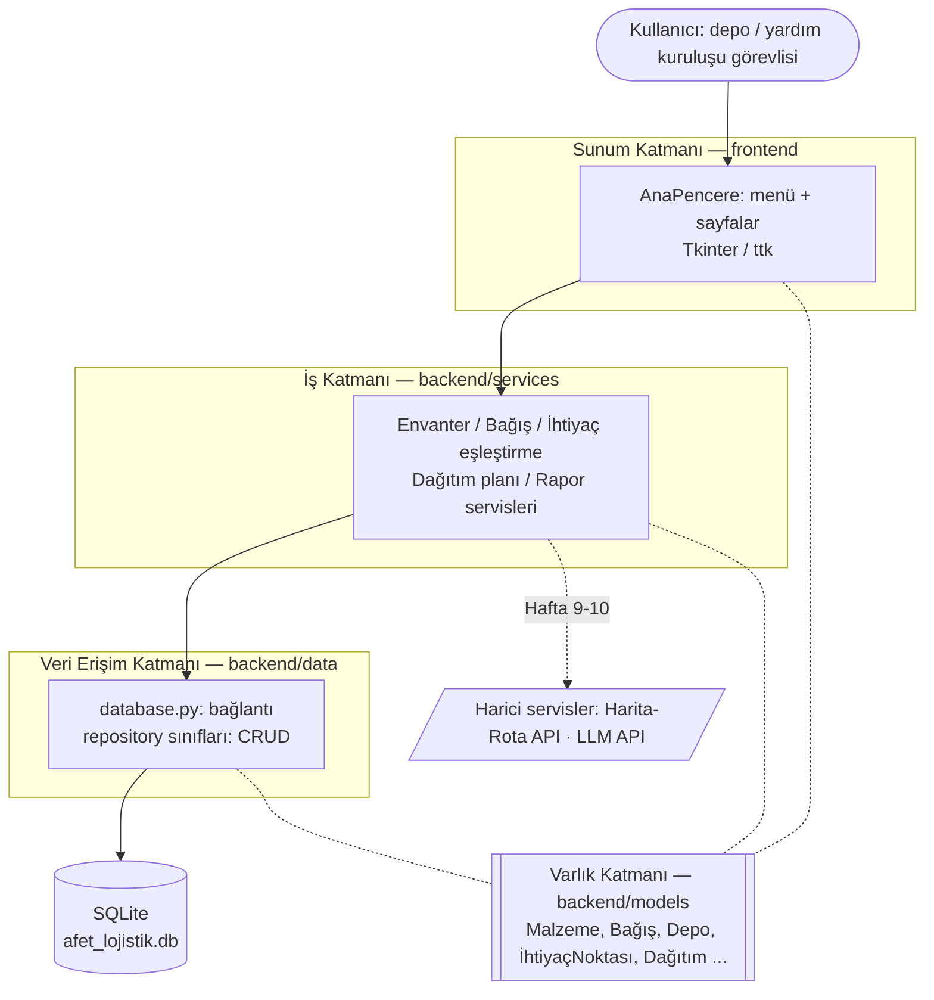

# Mimari Şema — P16 Afet Yardım Malzemesi Lojistik ve Dağıtım

**Uygulama türü:** Python masaüstü uygulaması
**Teknoloji yığını:** Python 3.12 · Tkinter/ttk (arayüz) · SQLite (`sqlite3`, veritabanı) · unittest (test)

## Katmanlı mimari (3 katman + ortak varlık katmanı)



Görsel sürüm: [mimari-sema.svg](mimari-sema.svg)

## Katmanların görevleri

| Katman | Klasör | Görev | Yapmaması gereken |
|---|---|---|---|
| Sunum | `frontend` | Pencereler, formlar, tablolar; kullanıcı girdisini alıp iş katmanına iletmek | SQL yazmak, iş kuralı uygulamak |
| İş | `backend/services` | Doğrulama, stok yeterli mi?, ihtiyaç–stok eşleştirme, öncelik/rota önerisi | Tkinter'a bağımlı olmak |
| Veri erişim | `backend/data` | Veritabanı bağlantısı, CRUD sorguları | İş kararı vermek |
| Varlık | `backend/models` | ER diyagramındaki tabloların Python karşılığı (dataclass) | Başka katmana bağımlı olmak |

**Frontend / backend ayrımı:** Sunum katmanı `frontend/` klasöründe; iş, veri erişim ve varlık katmanları `backend/` klasöründe. Frontend yalnızca backend'in servislerini çağırır, backend frontend'i hiç tanımaz.

**Bağımlılık yönü tek yönlüdür:** Sunum → İş → Veri. Alt katman üst katmanı tanımaz. Bu sayede ör. arayüz Tkinter'dan başka bir kütüphaneye geçse iş ve veri katmanı değişmez; iş kuralları arayüz açılmadan `unittest` ile test edilebilir.

## Klasör yapısı

```
Afet-Yardim-Malzemesi-Lojistik-ve-Dagitim/
├── main.py                  # Başlangıç noktası (python main.py)
├── backend/                 # BACKEND: arayüzden bağımsız çekirdek
│   ├── config.py            # Ayarlar; gizli anahtarlar ortam değişkeninden
│   ├── models/entities.py   # Varlık katmanı (ER → dataclass)
│   ├── services/            # İş katmanı
│   └── data/database.py     # Veri erişim katmanı (SQLite bağlantısı)
├── frontend/                # FRONTEND: masaüstü arayüz
│   └── main_window.py       # Sunum katmanı (Tkinter)
├── tests/                   # Birim testleri (unittest)
├── docs/                    # ER, mimari, haftalık raporlar, AI günlüğü
├── .gitignore  .env.example  requirements.txt  README.md
```

## Neden bu teknolojiler?

- **Python + Tkinter:** Python ile birlikte gelir, ek kurulum gerektirmez; kurumların depo bilgisayarlarında internet olmadan da çalışan bir masaüstü uygulaması hedefleniyor (afet bölgesinde bağlantı kesintisi gerçek bir risk).
- **SQLite:** Sunucu kurulumu gerektirmeyen, tek dosyalık, ilişkisel (yabancı anahtar ve transaction destekli) veritabanı. Tek depo/kurum ölçeği için yeterli; ileride PostgreSQL'e geçilirse yalnızca veri erişim katmanı değişir.
- **Katmanlı mimari:** Modüller (envanter, bağış, eşleştirme, dağıtım, takip, rapor) haftalık olarak eklenecek; her modül aynı üç katmanı izlediği için kod düzenli ve açıklanabilir kalır.
